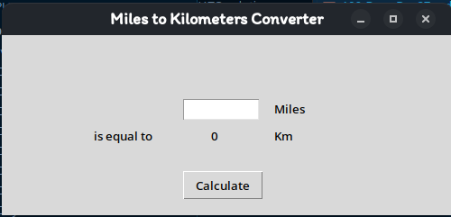

## Day 27 - Graphical User Interfaces with Tkinter and Function Arguments

### 244 - Day 27 Goals
We will be making Graphical User Interfaces using Tkinter and learning about Functional Arguments

We will build a unit conversion program with Tkinter so something like Miles to Kilometers

### 245 - History of GUI and Introduction to Tkinter
GUI is simply graphical useer interface and it is a way of communicating to a computer without any computing language
Check How the Mac Lisa looked it was one of the first GUIs

Check out the Movie Pirates of Sillicon Valley to get more understanding

### 246 - Creating Windws and Labels with Tkinter
Check the Tkinter documentary [here](docs.python.org/3/library/tkinter.html)

```Python
import tkinter

window = tkinter.Tk()

#Change Title
window.title("My First GUI Program")

#Changing Size
window.minsize(width=500, height=300)

#Label
my_label = tkinter.Label(text="I am a Label", font=("Arial",24,"bold"))
my_label.pack()

window.mainloop()
```

You first import tkinter and call an object from the class
the mainloop() keeps the window on the screen

a Label is a widget used to display text or images in a window.
It's often used for displaying information, instructions, or labels for other widgets (like buttons or entry fields). Labels are simple and customizable with properties like font, color, size, and alignment, but they are not interactive like buttons or entry fields.

In tkinter you create a label and tell how it is going to be placed before it will show
You can use the method .pack() to do that

### 247 - Setting Default Values for Optional Arguments inside a Function Header

Advanced Python Argumments
There are default Values for most arguments in some methods that is why when you run turtle it just appears but some too there are no default values like .write()

```Python
import tutle

tim = turtle.Turtle()
tim.write("Some Text",font=("Times New Roman", 80, "bold"))
```

### 248 - *args Many Positional Arguments
We are going to look at methods which provide more positional arguments
We can use the name *args which stands for arguments but you can just use the asterik

```Python
def add(*args):
    for n in args:
        print(n)
```
In this code we decide how many arguments we will use

#### Challenge
```
Modify the add function to take an unlimited number of arguments.
Use a loop to sum all the arguments inside the function
Test it out by calling add() to calculate the sum of some arguments
```
Solution is in 248-*args.py

### 249 - Kwargs , Many Keyword Arguments
**kwargs is a special syntax used in function definitions to allow the function to accept an arbitrary number of keyword arguments. "kwargs" stands for "keyword arguments," and the ** operator unpacks these arguments into a dictionary.
```python
def calculate(**kwargs):
    print(kwargs)

    n += kwargs["add"]
    n *= kwargs["multiply"]
    print(n)
calcualte(add=3, multiply=5)
```

You can use kwargs to create attributes in classes
```python
class Car:

    def __init__(self, **kw):
        self.make = kw.get("make")
        self.model = kw.get("model")
        self.colour = kw.get("colour")
        self.seats = kw.get("seats")

my_car = Car(make="Nissan", model="Skyline)
print(my_car.model)
```

### 250 - Buttons,Entry and Settings Component Options
Check documenation for the explanation of the code

```Python
from tkinter import *

window = Tk()
window.title("My First UI Program")
window.minsize(width=500,height=300)

#Label
my_label = Label(text="I Am a Label")
my_label.pack()

#To Change what is in the Label
my_label["text"] = "New Text"
my_label.config(text="New Text")

#Event Listener
def button_clicked():
    print("I got clicked")

#Button
button = Button(text="Click me", command=button_clicked)
button.pack()

window.mainloop()
```

This code create the tkinter ui and a button has been introduced 
It will do the command when clicked on
Watch the code well

#Challenge
Show "Button Got Clicked on my_label when the button get's clicked

The Entry class allows input from users

``` Python
#To allow input
input = Entry(width=10)
input.pack

#To get input
input.get()
```

CHallenge
Figure how what is written in the box should be displayed in the label

### 251 - Other Tkinter widgets
check this [site](repl.it/@appbrewery/tkinter-widget-demo) for all the widget codes and explanation
Code in 251-otherwidgets.py

### 252 -  Tkinter Layout Managers
In Tkinter, layout managers are used to arrange widgets (like buttons, labels, etc.) in a window. The three main layout managers in Tkinter are:

    pack - shows items in a vertical or horizontal position
    grid - shows data in a table position by using rows and columns
    place - precise positioning by providing x and y value

Each layout manager has different features and use cases.

### 253 - Mile to Kilometers Converter Project
Using what you learned in the last lesson create a mile to km converter 
You can use this image as a guidline



## CONGRATULATIONS YOU HAVE COMPLETED DAY 27